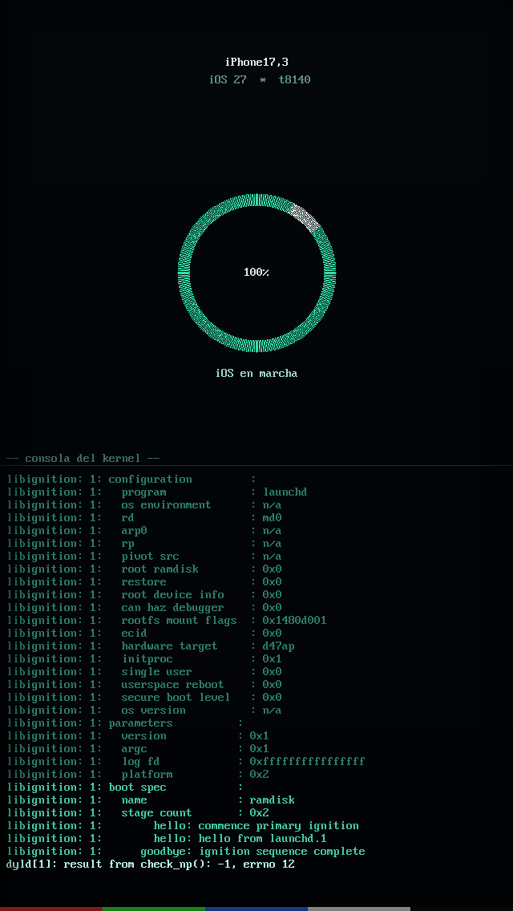
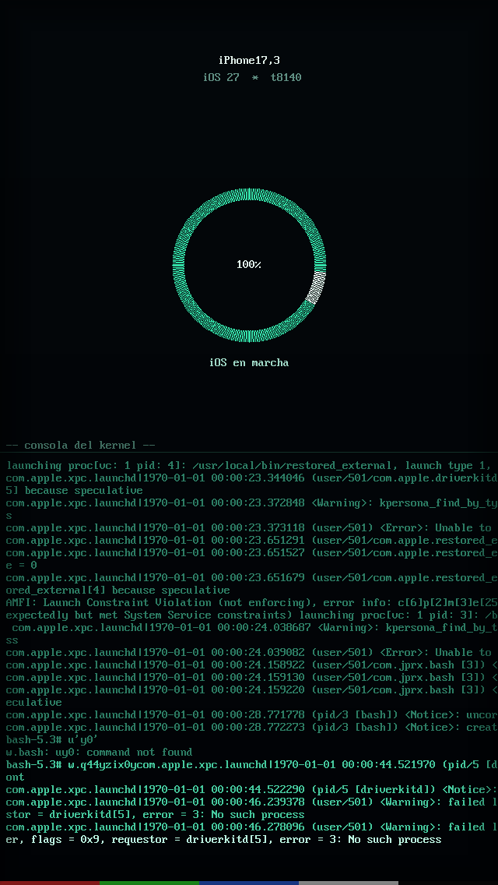
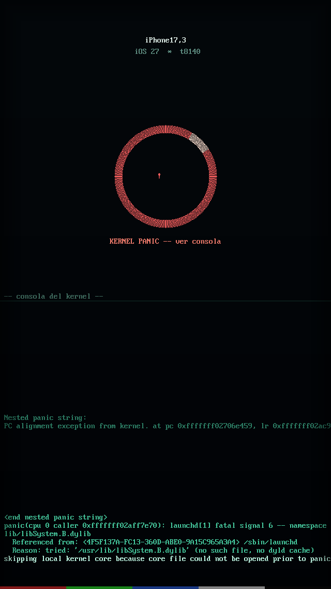
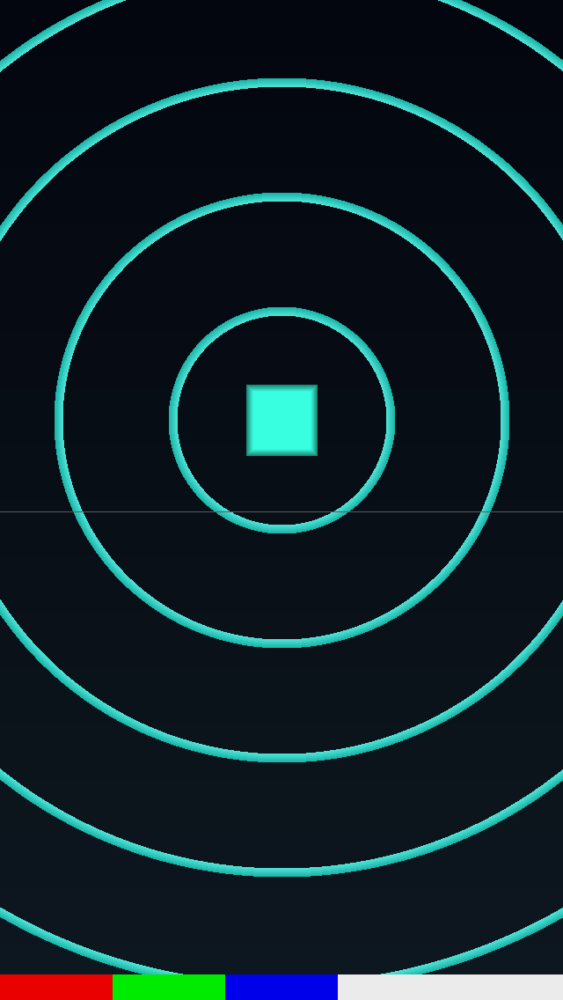
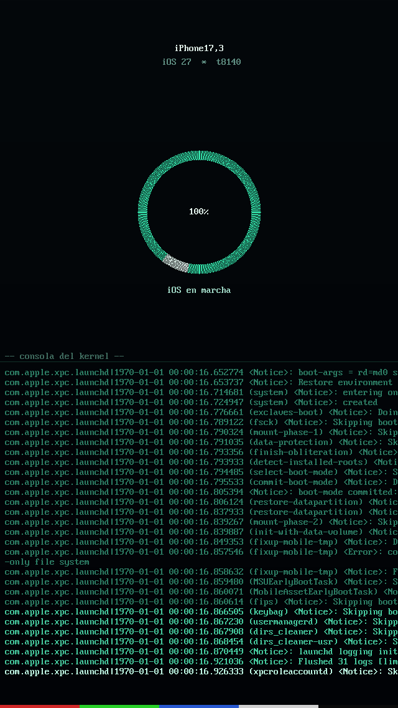
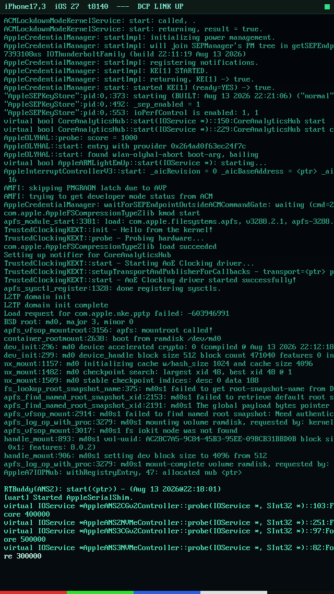
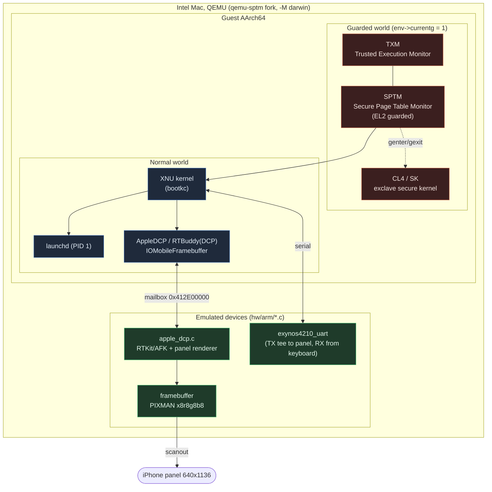
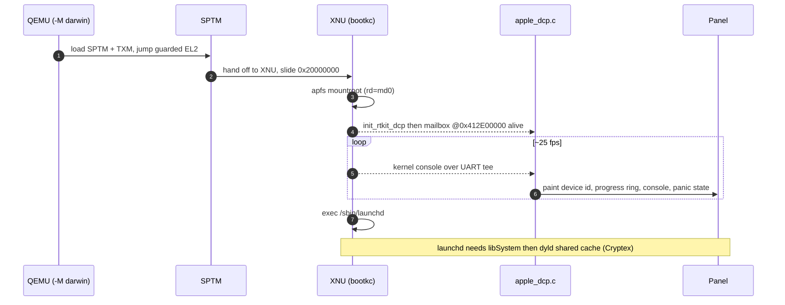
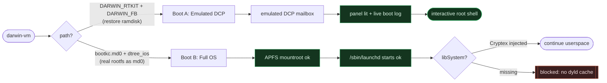
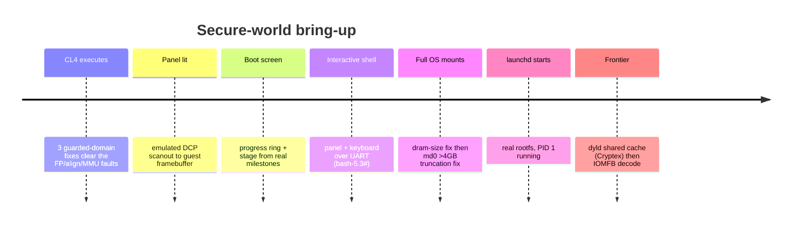

# iOS 27 Secure-World Bring-up on an Intel Mac

> **CURRENT STATE (2026-09-08):** Full iOS 27 userspace now boots. Hundreds of daemons run and
> SpringBoard spawns and runs (about 18 s). The current wall is that the rootfs is a READ-ONLY
> ramdisk with no writable /private/var, so SpringBoard aborts in BaseBoardUI (BSUIMappedImageCache).
> This is NOT the DCP/display and NOT CS_KILLED; both were crossed. Fix in flight: a kernel patch to
> mount the md0 root read-write (XNU sets MNT_RDONLY, not APFS). Live source of truth:
> STATE_darwinvm_boot.md and board.html in ios27-cl4-secure-world. Text below this banner predates
> this and is kept for history.


> **About:** Booting iOS 27 to its real root filesystem on an Intel Mac via
> darwin-vm / qemu-sptm: SPTM/XNU, the secure world, and a lit DCP panel. WIP research.

Booting **iOS 27** (iPhone17,3, `t8140`/`d47ap`, build `24A5430a`) all the way to
its **real root filesystem** on an Intel Mac, with no Apple Silicon and no device,
using [`jprx/darwin-vm`](https://github.com/jprx/darwin-vm) and its `qemu-sptm` fork,
and lighting the **DCP display panel** with the live boot log along the way.

<p align="center">
  
  
  
</p>

> **Status:** the full OS boots through SPTM to XNU, **mounts its real APFS root**, and
> starts `launchd`. The current frontier is the **dyld shared cache** (shipped in the
> `Cryptex1,SystemOS`) so `launchd` can load `libSystem`. See [Status](#status).

---

## Index

1. [What this is](#what-this-is)
2. [Screens (the milestones)](#screens-the-milestones)
3. [The secure world: where things live](#the-secure-world-where-things-live)
4. [Boot flow](#boot-flow)
5. [Two boot paths](#two-boot-paths)
6. [The DCP display path](#the-dcp-display-path)
7. [Status](#status)
8. [The three QEMU guarded-domain fixes](#the-three-qemu-guarded-domain-fixes)
9. [Runtime knobs (`DARWIN_*`)](#runtime-knobs-darwin_)
10. [Timeline](#timeline)
11. [Reproduce](#reproduce)
12. [Repo layout](#repo-layout)
13. [Legal / safety](#legal--safety)

---

## What this is

`darwin-vm` boots XNU under QEMU using Apple's real **SPTM** (Secure Page Table
Monitor) and **TXM** (Trusted Execution Monitor). This project pushes past a bare
kernel boot toward two goals:

- **A lit display.** Drive the **DCP** (Display CoProcessor) path far enough to paint
  a real panel (device id, boot progress, and the live kernel console) onto a
  640x1136 iPhone framebuffer.
- **A full OS.** Boot from the actual iOS root filesystem (not just the restore
  ramdisk), mount it, and reach `launchd`.

Both are working today; the remaining gate is a firmware component the user supplies
(the SystemOS **Cryptex**, which carries the dyld shared cache).

---

## Screens (the milestones)

| | |
|---|---|
|  | **Panel lit.** Emulated DCP scanout points the QEMU surface straight at guest framebuffer RAM. |
|  | **Graphical boot screen.** Progress ring and stage label driven by real boot milestones scraped from the serial log. |
|  | **Live kernel console** rendered on the panel with a built-in VGA font. |
|  | **Interactive root shell** (`bash-5.3#`): panel and keyboard wired to the guest UART. |
|  | **Full iOS root mounted.** `md0` APFS `mountroot`, `/sbin/launchd` starts. |

---

## The secure world: where things live



The **guarded world** is entered through GXF (`genter`/`gexit`); QEMU tracks it as
`env->currentg`. The three [core fixes](#the-three-qemu-guarded-domain-fixes) are all
gated on that flag so the normal-world XNU boot stays byte-for-byte unchanged.

---

## Boot flow



---

## Two boot paths



- **Boot A** is the display bring-up: an emulated DCP RTKit endpoint lights the panel
  and renders the real boot log. This is the "screen" you can watch live.
- **Boot B** is the real OS: the decrypted rootfs is loaded as `md0` and mounted. A
  32-bit page-count truncation in XNU's md-device driver (`mdSize << 12` in `w`
  registers) capped the device at 1.36 GB; widening six instructions to 64-bit
  ([`bootkc.md0`](qemu-patches/)) fixed it and the **9.3 GB root now mounts**.

---

## The DCP display path


Today the panel is painted **by the emulator** from the boot log (green = done, amber
= frontier). The next step for true pixels is decoding the iOS **IOMFB swap**
submissions in `apple_dcp.c` and blitting the guest surface directly, plus,
ultimately, an AGX GPU model for SpringBoard-level UI.

---

## Status

| Area | State |
|---|:--:|
| SPTM/TXM to XNU boot | done |
| Guarded-domain (SK/CL4) executes | done |
| DCP panel lit (scanout) | done |
| Real boot log on panel + progress | done |
| Interactive root shell on panel | done |
| Full rootfs boot to APFS `mountroot` | done |
| `md0` >4 GB truncation fix | done |
| `/sbin/launchd` starts | done |
| `libSystem` / dyld shared cache | blocked: needs SystemOS **Cryptex** |
| IOMFB real-surface decode | in progress |
| AGX GPU (SpringBoard UI) | not emulated |

**Immediate blocker.** The rootfs (`094-13182-141`) is the *split* SystemOS: it has
**no** `dyld_shared_cache` and no regular `libSystem.B.dylib`. Those live in the
`Cryptex1,SystemOS` (`094-13150-145`, ~2.3 GB), which the user decrypts and injects at
`/private/preboot/Cryptexes/OS` via [`inject_cryptex.sh`](scripts/inject_cryptex.sh).
See [`docs/NEXT-STEP-cryptex.md`](docs/NEXT-STEP-cryptex.md).

---

## The three QEMU guarded-domain fixes

All keyed on `env->currentg == 1`, so only the guarded world (SPTM/TXM/SK "CL4") is
affected and baseline XNU is untouched:

| # | File | Function | Change |
|---|------|----------|--------|
| 1 | `target/arm/helper.c` | `fp_exception_el()` | guarded: FP/SIMD always accessible |
| 2 | `target/arm/ptw.c` | `get_phys_addr_disabled()` | guarded MMU-off memory = Normal WB |
| 3 | `target/arm/tcg/hflags.c` | `aprofile_require_alignment()` | guarded: no forced alignment |

They are captured in
[`qemu-patches/qemu-guarded-domain-fixes.patch`](qemu-patches/); the full set
(CL4 loader in `hw/arm/xnuboot_sptm.c`, the `-cl4` option, and the emulated DCP) is in
[`qemu-patches/qemu-sptm-cl4-all.patch`](qemu-patches/).

---

## Runtime knobs (`DARWIN_*`)

Environment toggles read by `hw/arm/darwin.c`:

| Knob | Effect |
|------|--------|
| `DARWIN_RTKIT=1` | bring up the emulated DCP RTKit mailbox (`0x412E00000`): **lights the panel** |
| `DARWIN_FB=1` | framebuffer + `boot_args.Video` + keyboard on the panel |
| `DARWIN_DISP=all\|<substr>` | back display register ranges (RAZ/WI); `dcp0-expert` fixes the DCP MMIO SEA |
| `DARWIN_AIC` / `DARWIN_DART` / `DARWIN_PMGR` | back the interrupt controller / DARTs / power manager |
| `DARWIN_DCPFW=<path>` | supply DCP firmware |
| `DARWIN_NOPAC=1` | runtime PAC-disable toggle (diagnostic) |

---

## Timeline



Full narrative: [`docs/RESUME-secure-world.md`](docs/RESUME-secure-world.md)
(live handoff, **read first**) and [`docs/FINDINGS-ios27-display.md`](docs/FINDINGS-ios27-display.md).

---

## Reproduce

```bash
# 1) build qemu-sptm with the patches
./rebuild-qemu.sh

# 2a) Boot A: lit panel + live log (restore ramdisk)
DARWIN_RTKIT=1 DARWIN_FB=1 ./run/view_screen.sh

# 2b) Boot B: full OS from the real rootfs (needs the Cryptex for userspace)
./scripts/inject_cryptex.sh <decrypted Cryptex1,SystemOS .dmg|.aea>
ROOTFS=firmware/rootfs_with_cryptex.dmg ./run/run_rootfs.sh
```

You supply the firmware. `run_rootfs.sh` defaults to the `bootkc.md0` kernelcache
(the one with the `md0` truncation fix) and the 20 GB `dtree_ios` device tree.

---

## Repo layout

```
docs/         RESUME (handoff), FINDINGS (narrative), cryptex next-step
qemu-patches/ the qemu-sptm patches + BASE commit
scripts/      inject_cryptex, dt_fixup, rtkit/dcp scaffolding, parsers
run/          panel boot, full OS boot, VNC live-view
shots/        panel screenshots
experiments/  per-investigation notes (md0-size, appledcp-crashA, cl4-*)
board.html    visual "motherboard" of the secure world
```

---

## Legal / safety

Per ChefKiss Inferno's notice: **no firmware, IVs, keys, or decrypted images are in
this repo** (see `.gitignore`). Firmware acquisition and decryption are left to the
user. No AGPL Inferno code is copied; device models are written from GPL-2 references,
and the QEMU changes are against the GPL-2 `qemu-sptm` fork.
