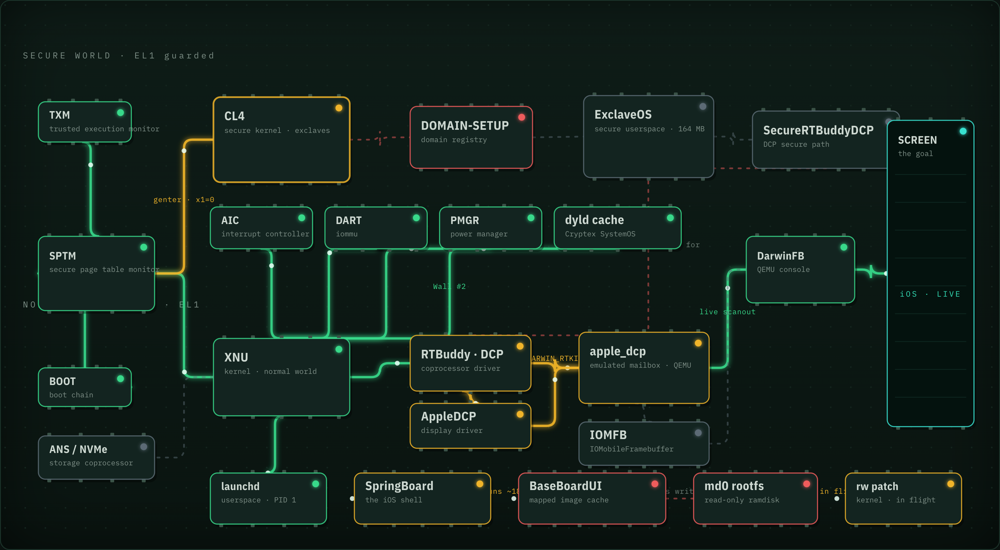
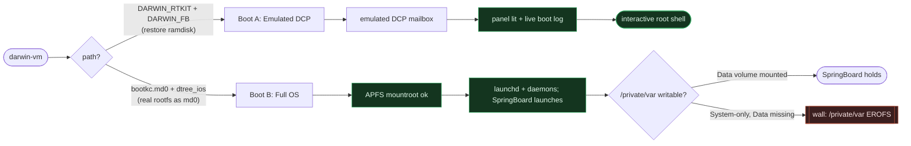
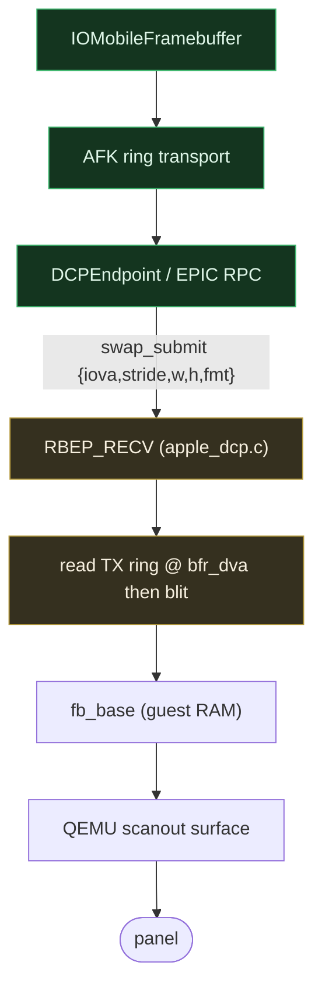
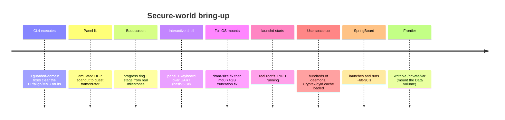

# iOS 27 on Intel QEMU, SpringBoard, no Apple Silicon

**iOS 27 booting to SpringBoard on an ordinary Intel Mac under QEMU -- no Apple Silicon, no
device.** vphone needs Apple Silicon; this is the copyable path for the Intel Macs most people
already have. Definition of done, in order: (1) `/private/var` writable (fixup-mobile-tmp, no
EROFS); (2) SpringBoard stays up > 5 minutes with no 3-strike reboot; (3) guest pixels in the QEMU
window (IOMFB blit or VNC of the guest framebuffer -- the boot-log painter does not count).

> **CURRENT STATE (2026-09-09):** Full iOS 27 userspace boots. Hundreds of daemons run and
> SpringBoard now launches and runs for about 60-90 s of guest time (it used to crash-loop at
> ~20-31 s). The libSystem / dyld shared cache / Cryptex stage is long crossed; so are DCP/display
> and CS_KILLED. The remaining wall is a writable **/private/var**: on a real device /private/var is
> a separate read-write **Data** volume, and this boot mounted only the read-only **System** volume,
> so writes to /private/var fail EROFS -- fixup-mobile-tmp and SpringBoard's BaseBoardUI temp cache
> (BSUIMappedImageCache) among them.
>
> Progress toward that: an in-kernel `mount -uw /` (clear MNT_RDONLY in apfs_vfsop_mountroot) took
> SpringBoard from ~20 s to ~60-90 s. A **Data** volume was then synthesized and paired into a real
> APFS **volume group** (matching apfs_volume_group_id + Fletcher-64 surgery), which makes the
> kernel's ROSV shadow-fs-root path fire. The last piece is getting the Data volume actually mounted
> at /private/var -- pursued now via lever 1 (MobileStorageMounter mount-phase) plus a small
> userspace mount helper. Kernel-side `kernel_mount` injection is PARKED (XNU-core mount symbols are
> stripped in this release kernelcache). Live source of truth: `docs/STATE_darwinvm_boot.md`. Text
> below this banner predates this and is kept for history.


> **About:** Booting iOS 27 to its real root filesystem on an Intel Mac via
> darwin-vm / qemu-sptm: SPTM/XNU, the secure world, and a lit DCP panel. WIP research.

Booting **iOS 27** (iPhone17,3, `t8140`/`d47ap`, build `24A5430a`) all the way to
its **real root filesystem** on an Intel Mac, with no Apple Silicon and no device,
using [`jprx/darwin-vm`](https://github.com/jprx/darwin-vm) and its `qemu-sptm` fork,
and lighting the **DCP display panel** with the live boot log along the way.

<p align="center">
  
</p>

<p align="center"><em>The device we built in software, chip by chip. Green works, amber is the current wall, red is blocked, gray is a stub or a later wall. Interactive version: <code>board.html</code>.</em></p>

<p align="center">
  
</p>

<p align="center"><em>The emulated panel with the live English kernel console (DCP LINK UP, real driver init, APFS mountroot). SpringBoard has not rendered yet -- see the board above for the current wall.</em></p>

> **Status:** the full OS boots through SPTM to XNU, **mounts its real APFS root**, starts
> `launchd`, runs hundreds of daemons, and **launches SpringBoard** (it survives ~60-90 s). The
> current frontier is a writable **/private/var**: only the read-only System volume is mounted, so
> the Data-volume subtree is unwritable. See [Status](#status).

---

## Index

1. [What this is](#what-this-is)
2. [Screens (the milestones)](#screens-the-milestones)
3. [The secure world: where things live](#the-secure-world-where-things-live)
4. [Boot flow](#boot-flow)
5. [Two boot paths](#two-boot-paths)
6. [The DCP display path](#the-dcp-display-path)
7. [Status](#status)
8. [The three QEMU guarded-domain fixes](#the-three-qemu-guarded-domain-fixes)
9. [Runtime knobs (`DARWIN_*`)](#runtime-knobs-darwin_)
10. [Timeline](#timeline)
11. [Reproduce](#reproduce)
12. [Repo layout](#repo-layout)
13. [Legal / safety](#legal--safety)

---

## What this is

`darwin-vm` boots XNU under QEMU using Apple's real **SPTM** (Secure Page Table
Monitor) and **TXM** (Trusted Execution Monitor). This project pushes past a bare
kernel boot toward two goals:

- **A lit display.** Drive the **DCP** (Display CoProcessor) path far enough to paint
  a real panel (device id, boot progress, and the live kernel console) onto a
  640x1136 iPhone framebuffer.
- **A full OS.** Boot from the actual iOS root filesystem (not just the restore
  ramdisk), mount it, and reach `launchd`.

Both are working today. Full userspace boots (the SystemOS **Cryptex** dyld shared cache
is supplied and injected) and SpringBoard launches; the current gate is a writable
`/private/var` (see [Status](#status)).

---

## Screens (the milestones)

| | |
|---|---|
|  | **Panel lit.** Emulated DCP scanout points the QEMU surface straight at guest framebuffer RAM. |
|  | **Graphical boot screen (full OS).** English progress ring driven by the real boot stage, over the live kernel console as hundreds of daemons launch. |
|  | **Live kernel console** rendered on the panel with a built-in VGA font. |
|  | **Restore ramdisk (Boot A).** The English restore console on the panel; panel and keyboard are wired to the guest UART. |

---

## The secure world: where things live


The **guarded world** is entered through GXF (`genter`/`gexit`); QEMU tracks it as
`env->currentg`. The three [core fixes](#the-three-qemu-guarded-domain-fixes) are all
gated on that flag so the normal-world XNU boot stays byte-for-byte unchanged.

---

## Boot flow

```mermaid
sequenceDiagram
    autonumber
    participant Q as QEMU (-M darwin)
    participant S as SPTM
    participant X as XNU (bootkc)
    participant D as apple_dcp.c
    participant P as Panel

    Q->>S: load SPTM + TXM, jump guarded EL2
    S->>X: hand off to XNU, slide 0x20000000
    X->>X: apfs mountroot (rd=md0)
    X-->>D: init_rtkit_dcp then mailbox @0x412E00000 alive
    loop ~25 fps
        X-->>D: kernel console over UART tee
        D->>P: paint device id, progress ring, console, panic state
    end
    X->>X: exec /sbin/launchd
    Note over X,P: launchd + hundreds of daemons run; SpringBoard launches (~60-90 s)
    Note over X,P: wall: /private/var not writable (Data volume not mounted)
```

---

## Two boot paths



- **Boot A** is the display bring-up: an emulated DCP RTKit endpoint lights the panel
  and renders the real boot log. This is the "screen" you can watch live.
- **Boot B** is the real OS: the decrypted rootfs is loaded as `md0` and mounted. A
  32-bit page-count truncation in XNU's md-device driver (`mdSize << 12` in `w`
  registers) capped the device at 1.36 GB; widening six instructions to 64-bit
  ([`bootkc.md0`](qemu-patches/)) fixed it and the **9.3 GB root now mounts**.

---

## The DCP display path



Today the panel is painted **by the emulator** from the boot log (green = done, amber
= frontier). The next step for true pixels is decoding the iOS **IOMFB swap**
submissions in `apple_dcp.c` and blitting the guest surface directly, plus,
ultimately, an AGX GPU model for SpringBoard-level UI.

---

## Status

| Area | State |
|---|:--:|
| SPTM/TXM to XNU boot | done |
| Guarded-domain (SK/CL4) executes | done |
| DCP panel lit (scanout) | done |
| Real boot log on panel + progress | done |
| Interactive root shell on panel | done |
| Full rootfs boot to APFS `mountroot` | done |
| `md0` >4 GB truncation fix | done |
| `/sbin/launchd` starts | done |
| `libSystem` / dyld shared cache (Cryptex) | done |
| Full userspace: hundreds of daemons | done |
| **SpringBoard launches and runs (~60-90 s)** | done |
| Root mounted read-write in-kernel (`mount -uw /`) | done |
| Data volume synthesized + APFS volume group formed | done |
| Kernel ROSV shadow-fs-root fires | done |
| **Writable `/private/var` (mount Data volume)** | in progress -- current wall |
| IOMFB real-surface decode | later |
| AGX GPU (SpringBoard UI) | not emulated |

**Immediate blocker: writable `/private/var`.** Full userspace boots and SpringBoard launches
and runs ~60-90 s, then aborts because `/private/var` is not writable. On a real device
`/private/var` is a separate read-write **Data** volume in the same APFS volume group as the
read-only **System** volume; this boot loaded only the System volume, so `/private/var` writes
return EROFS (fixup-mobile-tmp and SpringBoard's BaseBoardUI `BSUIMappedImageCache` among them).

Done so far: an in-kernel `mount -uw /` (clearing `MNT_RDONLY` in `apfs_vfsop_mountroot`) extended
SpringBoard from ~20 s to ~60-90 s; a **Data** volume was synthesized and paired into a real APFS
**volume group** (matching `apfs_volume_group_id` + Fletcher-64 checksum surgery), which makes the
kernel's ROSV shadow-fs-root path fire. The remaining piece is mounting that Data volume at
`/private/var`, pursued via `MobileStorageMounter`'s mount phases plus a small userspace mount
helper. A kernel-side `kernel_mount` injection is parked because XNU-core mount symbols are stripped
in this release kernelcache. The earlier Cryptex / dyld-shared-cache stage is long crossed; the
Cryptex is injected at `/private/preboot/Cryptexes/OS` via
[`inject_cryptex.sh`](scripts/inject_cryptex.sh). Full detail: [`docs/STATE_darwinvm_boot.md`](docs/STATE_darwinvm_boot.md).

---

## The three QEMU guarded-domain fixes

All keyed on `env->currentg == 1`, so only the guarded world (SPTM/TXM/SK "CL4") is
affected and baseline XNU is untouched:

| # | File | Function | Change |
|---|------|----------|--------|
| 1 | `target/arm/helper.c` | `fp_exception_el()` | guarded: FP/SIMD always accessible |
| 2 | `target/arm/ptw.c` | `get_phys_addr_disabled()` | guarded MMU-off memory = Normal WB |
| 3 | `target/arm/tcg/hflags.c` | `aprofile_require_alignment()` | guarded: no forced alignment |

They are captured in
[`qemu-patches/qemu-guarded-domain-fixes.patch`](qemu-patches/); the full set
(CL4 loader in `hw/arm/xnuboot_sptm.c`, the `-cl4` option, and the emulated DCP) is in
[`qemu-patches/qemu-sptm-cl4-all.patch`](qemu-patches/).

---

## Runtime knobs (`DARWIN_*`)

Environment toggles read by `hw/arm/darwin.c`:

| Knob | Effect |
|------|--------|
| `DARWIN_RTKIT=1` | bring up the emulated DCP RTKit mailbox (`0x412E00000`): **lights the panel** |
| `DARWIN_FB=1` | framebuffer + `boot_args.Video` + keyboard on the panel |
| `DARWIN_DISP=all\|<substr>` | back display register ranges (RAZ/WI); `dcp0-expert` fixes the DCP MMIO SEA |
| `DARWIN_AIC` / `DARWIN_DART` / `DARWIN_PMGR` | back the interrupt controller / DARTs / power manager |
| `DARWIN_DCPFW=<path>` | supply DCP firmware |
| `DARWIN_NOPAC=1` | runtime PAC-disable toggle (diagnostic) |

---

## Timeline



Full narrative: [`docs/RESUME-secure-world.md`](docs/RESUME-secure-world.md)
(live handoff, **read first**) and [`docs/FINDINGS-ios27-display.md`](docs/FINDINGS-ios27-display.md).

---

## Reproduce

```bash
# 1) build qemu-sptm with the patches
./rebuild-qemu.sh

# 2a) Boot A: lit panel + live log (restore ramdisk)
DARWIN_RTKIT=1 DARWIN_FB=1 ./run/view_screen.sh

# 2b) Boot B: full OS from the real rootfs (needs the Cryptex for userspace)
./scripts/inject_cryptex.sh <decrypted Cryptex1,SystemOS .dmg|.aea>
ROOTFS=firmware/rootfs_with_cryptex.dmg ./run/run_rootfs.sh
```

You supply the firmware. `run_rootfs.sh` defaults to the `bootkc.md0` kernelcache
(the one with the `md0` truncation fix) and the 20 GB `dtree_ios` device tree.

---

## Repo layout

```
docs/         RESUME (handoff), FINDINGS (narrative), cryptex next-step
qemu-patches/ the qemu-sptm patches + BASE commit
scripts/      inject_cryptex, dt_fixup, rtkit/dcp scaffolding, parsers
run/          panel boot, full OS boot, VNC live-view
shots/        panel screenshots
experiments/  per-investigation notes (md0-size, appledcp-crashA, cl4-*)
board.html    visual "motherboard" of the secure world
```

---

## Legal / safety

Per ChefKiss Inferno's notice: **no firmware, IVs, keys, or decrypted images are in
this repo** (see `.gitignore`). Firmware acquisition and decryption are left to the
user. No AGPL Inferno code is copied; device models are written from GPL-2 references,
and the QEMU changes are against the GPL-2 `qemu-sptm` fork.
